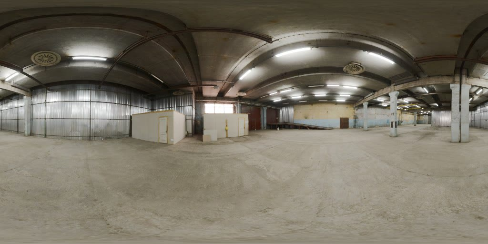
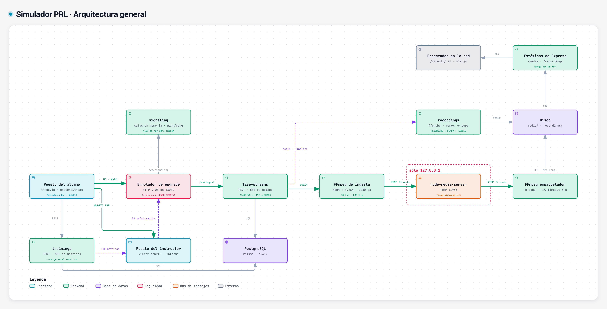
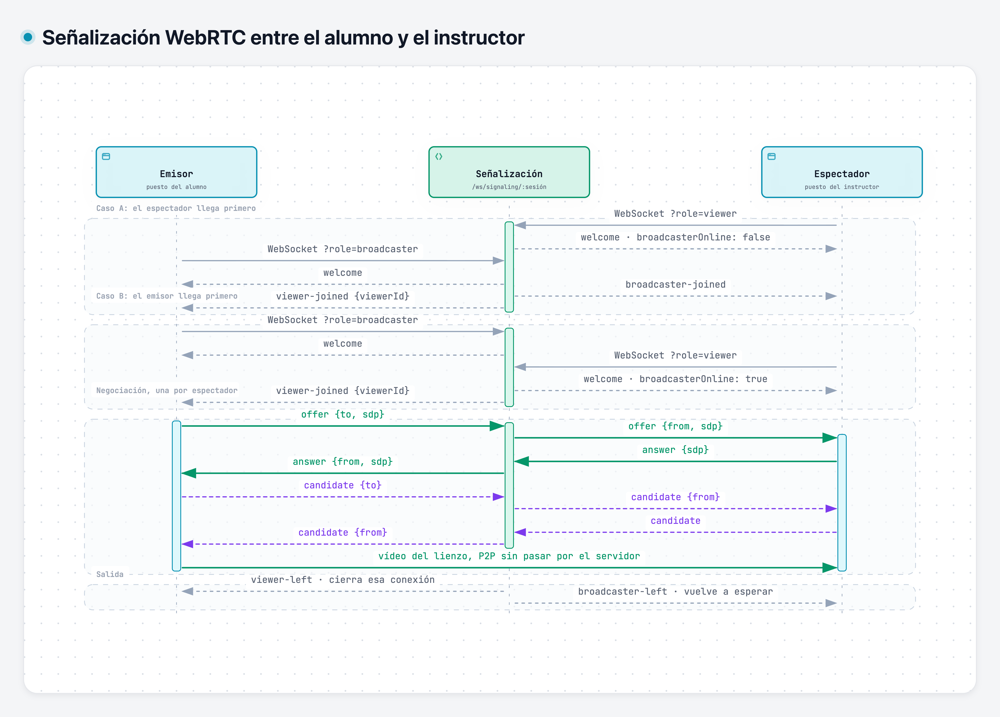
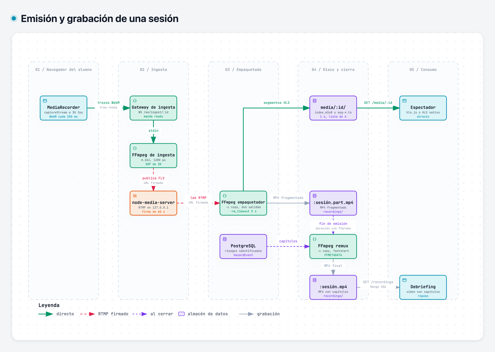
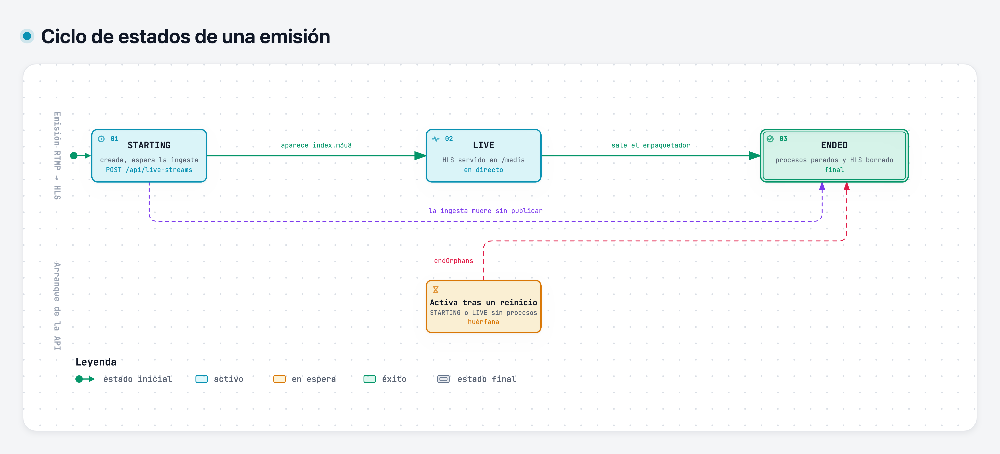
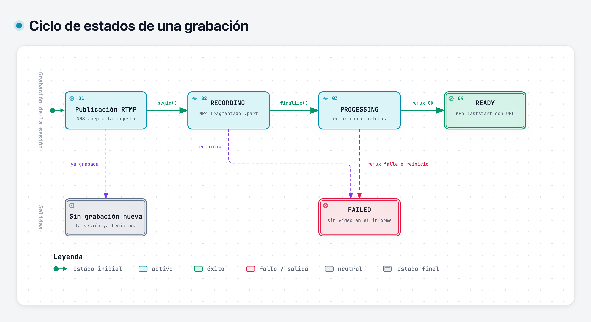

# Simulador PRL

Prototipo de formación práctica en prevención de riesgos laborales con gafas de realidad virtual. El alumno
recorre un taller de mantenimiento con cuatro riesgos, los señala con la mirada y elige qué hacer con cada uno.
El instructor ve su vista en directo, cualquier equipo de la red puede seguir la sesión con un enlace, y al
terminar hay un informe con veredicto de apto o no apto y el vídeo de la sesión dividido en capítulos.

No hay gafas reales. El navegador simula con three.js a un alumno que se pone el visor, y la cabeza se gira con
el ratón o con las flechas. El lienzo WebGL de esa escena es la fuente de vídeo de todo lo demás.

Los diagramas interactivos de la arquitectura están publicados en https://jmrg-link.github.io/simulador-prl/.

## Cómo funciona

Una sesión tiene tres partes: el briefing, un recorrido de tres minutos y el debriefing. Alumno e instructor
comparten pantalla en modo aula, pero se comunican por la red como si estuvieran en equipos distintos.

El vídeo sale del lienzo por dos caminos. Al instructor le llega por WebRTC, con menos de un segundo de retardo,
y el backend solo hace la señalización. A los espectadores les llega por HLS, con unos segundos de retardo pero
apoyado en la caché HTTP: el navegador manda el vídeo al backend por WebSocket, FFmpeg lo publica por RTMP firmado
en un servidor RTMP embebido y otro FFmpeg lo empaqueta en HLS. Ese mismo empaquetador escribe la grabación, que
al cerrar la emisión se convierte en un MP4 con un capítulo por riesgo identificado.

Las decisiones del alumno las corrige el servidor, que no envía la respuesta correcta hasta que la sesión se
cierra. Las métricas se guardan en PostgreSQL y llegan al instructor por SSE.

### Escena 3D

El taller se modela con scripts de Blender (`frontend/blender/`) a partir de modelos y texturas CC0 de Poly Haven. Lo
ilumina el HDRI [`empty_warehouse_01`](https://polyhaven.com/a/empty_warehouse_01), que el frontal carga como entorno:
da la luz y los reflejos de los materiales, pero no se pinta como fondo. Lo que se ve son las paredes, el suelo y
los objetos del modelo.



### Diagramas

Cada imagen abre su diagrama interactivo, publicado en [GitHub Pages](https://jmrg-link.github.io/simulador-prl/). Ahí se pueden recorrer las rutas, aislar
un componente con sus dependencias y leer las fichas con el detalle de cada parte.

#### Arquitectura general

La API usa un solo puerto HTTP. Los WebSockets entran por el mismo puerto, y un enrutador los reparte por prefijo
después de comprobar el `Origin`. node-media-server y los procesos de FFmpeg corren en la misma máquina que la API,
y el RTMP solo escucha en `127.0.0.1`.

<a href="https://jmrg-link.github.io/simulador-prl/arquitectura/arquitectura-general.html"><picture>
  <source media="(prefers-color-scheme: dark)" srcset="docs/arquitectura/arquitectura-general-oscuro.png">
  
</picture></a>

#### Señalización WebRTC

La sala es el id de la sesión de formación y solo existe en memoria. El emisor siempre hace la oferta, con una
`RTCPeerConnection` por espectador, y el espectador solo responde. Así nunca se cruzan dos ofertas.

<a href="https://jmrg-link.github.io/simulador-prl/arquitectura/senalizacion-webrtc.html"><picture>
  <source media="(prefers-color-scheme: dark)" srcset="docs/arquitectura/senalizacion-webrtc-oscuro.png">
  
</picture></a>

#### Emisión y grabación

La emisión y la grabación salen del mismo empaquetador y no se recodifican: solo la ingesta codifica en H.264.

<a href="https://jmrg-link.github.io/simulador-prl/arquitectura/flujo-emision-grabacion.html"><picture>
  <source media="(prefers-color-scheme: dark)" srcset="docs/arquitectura/flujo-emision-grabacion-oscuro.png">
  
</picture></a>

#### Estados de una emisión y de una grabación

Cada transición de una emisión se aplica con `UPDATE … WHERE status IN (…)` y se publica por SSE. Al arrancar, el
backend cierra las emisiones y las grabaciones que un reinicio dejó a medias.

<a href="https://jmrg-link.github.io/simulador-prl/arquitectura/estados-emision.html"><picture>
  <source media="(prefers-color-scheme: dark)" srcset="docs/arquitectura/estados-emision-oscuro.png">
  
</picture></a>

<a href="https://jmrg-link.github.io/simulador-prl/arquitectura/estados-grabacion.html"><picture>
  <source media="(prefers-color-scheme: dark)" srcset="docs/arquitectura/estados-grabacion-oscuro.png">
  
</picture></a>

## Arranque en local

Hace falta Node 24, pnpm 11 (con `corepack enable` basta), Docker, y FFmpeg con ffprobe para la difusión y la
grabación. Si no están en el `PATH`, sus rutas van en `FFMPEG_PATH` y `FFPROBE_PATH`.

PostgreSQL corre en Docker; el backend y el frontal, en el host.

```sh
cd backend
cp .env.example .env
docker compose up -d db
pnpm install
pnpm run db:generate
pnpm run db:deploy
pnpm dev
```

Antes de levantar la base hay que rellenar en `.env` las credenciales de PostgreSQL, `DATABASE_URL` con esas
mismas credenciales contra `localhost:5432`, y `RTMP_SECRET` con al menos 16 caracteres. La API queda en el
puerto 3000.

En otra terminal:

```sh
cd frontend
pnpm install
pnpm dev
```

La aplicación se abre en http://localhost:5173. Vite reenvía al backend la API, el HLS, las grabaciones y los
WebSockets, así que todo comparte origen. Para que otro equipo abra el enlace de difusión, el servidor de
desarrollo escucha también en la red local.

También se puede levantar todo con Docker: `docker compose up --build` en `backend/` levanta la base y la API, y
en `frontend/` sirve el frontal con nginx en http://localhost:8080.

## Estructura

```
backend/    API Express en TypeScript, ejecutada con el type stripping de Node 24
  src/modules/trainings      sesiones, escenario, corrección y métricas
  src/modules/signaling      señalización WebRTC por WebSocket
  src/modules/live-streams   ingesta, RTMP y empaquetado HLS
  src/modules/recordings     grabación MP4 con capítulos
  prisma/                    esquema y migraciones de PostgreSQL
frontend/   React 19 con Vite, three.js y Tailwind 4
  src/features/              modo aula, gafas, emisión, instructor y directo
  blender/                   scripts de Blender que generan los modelos .glb
  public/models/             modelos y HDRI ya generados
docs/
  prd/                       un documento de requisitos por capacidad
  arquitectura/              diagramas interactivos y sus vistas previas
  escena/                    vista del HDRI que ilumina la escena 3D
```

Son dos proyectos independientes, cada uno con su `package.json`, su lockfile y su `compose.yml`. No comparten
código: el protocolo de señalización y los esquemas de la API están duplicados a propósito en los dos y se
cambian a la vez.

En la raíz solo están commitlint y husky: `pnpm install` en la raíz instala el hook que valida que cada mensaje
de commit siga Conventional Commits.

`pnpm run verify` en cada proyecto pasa el typecheck, el lint y los tests; en el frontal, además, el build.

## Requisitos

Cada capacidad tiene su PRD en [`docs/prd/`](docs/prd/README.md), con sus requisitos, sus criterios de aceptación
y el test que demuestra cada uno.

| PRD | Capacidad |
| --- | --- |
| [00](docs/prd/00-vision-producto.md) | Visión de producto |
| [01](docs/prd/01-formacion-evaluable.md) | Formación evaluable con decisiones y veredicto |
| [02](docs/prd/02-supervision-webrtc.md) | Supervisión del instructor por WebRTC |
| [03](docs/prd/03-difusion-rtmp-hls.md) | Difusión a espectadores por RTMP y HLS |
| [04](docs/prd/04-grabacion-capitulos.md) | Grabación de la sesión con capítulos |
| [05](docs/prd/05-escena-3d.md) | Escena 3D y simulación de las gafas |
| [06](docs/prd/06-interfaz-modo-aula.md) | Interfaz en modo aula y sistema visual |

Los modelos 3D usan assets CC0 de Poly Haven, listados en `frontend/public/models/SOURCES.txt`.
